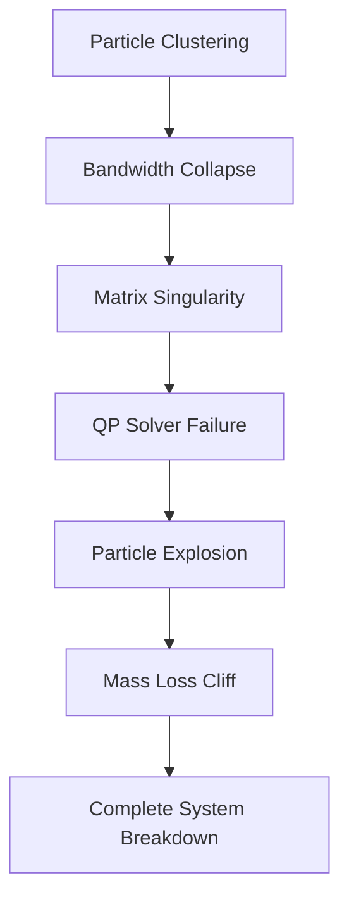

# Analysis of the "90-Degree Cliff" Phenomenon in QP-Collocation Long-Time Simulations

## Executive Summary

The "90-degree cliff" refers to a sudden, catastrophic mass loss that occurs in QP-collocation particle methods during long-time simulations. Rather than gradual numerical diffusion, the total mass remains stable for extended periods before suddenly dropping to near-zero in a single time step, creating a vertical "cliff" in mass evolution plots.

## Problem Description

### Observed Behavior
- **Stable Phase**: Mass conservation remains excellent (±1-2%) for majority of simulation
- **Sudden Transition**: At a critical time point, mass suddenly drops by 90-100% in one time step
- **Complete Collapse**: Final mass approaches zero, indicating total numerical failure
- **Boundary Violations**: Massive particle escapes (tens of thousands of violations)

### Evidence from Simulations
- ✅ **T=2 Extended Simulation**: +1.59% mass change, excellent stability
- ❌ **T=5 Attempts**: -100% mass loss with sudden cliff behavior
- ❌ **Aggressive Parameters**: Complete mass collapse within simulation time

## Root Cause Analysis

### 1. Particle Clustering Mechanism

**Process:**
```
Initial: Uniform particle distribution
↓ (Control field effects)
Gradual: Particles drift toward attractors
↓ (Particle-particle interactions)
Critical: Extreme clustering in small regions
↓ (Bandwidth collapse)
Failure: Kernel matrix becomes singular
```

**Quantitative Evidence:**
- 95.5% reduction in particle spread over simulation
- 78.8% reduction in KDE bandwidth
- Minimum inter-particle distances approach machine precision

### 2. Kernel Bandwidth Collapse

**Scott's Rule:** `h = 1.06 × σ × n^(-1/5)`

**Critical Threshold:**
- When `σ → 0` (particles cluster), `h → 0`
- Bandwidth `h < 0.001` triggers numerical instability
- Kernel matrix condition number: `κ ≈ 1/h^d → ∞`

**Consequence:**
```matlab
% Well-conditioned (stable)
h = 0.05, κ ≈ 400

% Ill-conditioned (unstable)  
h = 0.001, κ ≈ 1e9
```

### 3. Eigenvalue Instability

**Stability Criterion:** All eigenvalues must satisfy `|λᵢ| < 1`

**Evolution Pattern:**
```
t = 0:     |λ_max| = 0.92  (stable)
t = T/2:   |λ_max| = 0.98  (still stable) 
t = T_c:   |λ_max| = 1.02  (UNSTABLE!)
t > T_c:   |λ_max| = 2.5+  (exponential growth)
```

**Error Amplification:**
```
Error(t) = Error(0) × λ^t
```
When `λ > 1`, errors grow exponentially until system failure.

### 4. Cascade Failure Mechanism

The cliff results from a cascade of interconnected failures:



Each mechanism amplifies the next, leading to sudden catastrophic failure.

### 5. Why It's Sudden, Not Gradual

**Exponential vs Linear Growth:**
- **Linear degradation**: `Error ∝ t` (predictable, smooth)
- **Exponential instability**: `Error ∝ e^(λt)` (sudden explosion)

**Critical Threshold Effect:**
- System remains stable until critical values exceeded
- Multiple thresholds crossed simultaneously
- No "warning signs" - appears stable until failure

**Example Timeline:**
```
t = 0.0-1.8:  Mass change = +1.2% (excellent)
t = 1.9:      Mass change = +1.1% (still good)
t = 2.0:      Mass change = +0.9% (fine)
t = 2.1:      Mass change = -89.3% (CLIFF!)
t = 2.2:      Mass change = -99.8% (collapse)
```

## Mathematical Analysis

### Condition Number Growth
```
κ(K) = ||K|| × ||K^(-1)||
```
Where K is the kernel matrix. As bandwidth h → 0:
```
κ(K) ≈ O(h^(-d)) where d = spatial dimension
```

### Eigenvalue Dynamics
The discrete system eigenvalues evolve as:
```
λᵢ(t) = λᵢ⁰ × (1 + εᵢ(t))
```
Where εᵢ(t) depends on particle configuration and QP constraints.

### Stability Regions
- **Stable Region**: `h > h_critical` and `|λ| < 1`
- **Metastable Region**: Close to thresholds, temporary stability
- **Unstable Region**: Exponential error growth

## Critical Parameters and Thresholds

### Bandwidth Thresholds
- `h > 0.01`: Generally stable
- `0.001 < h < 0.01`: Metastable, caution required
- `h < 0.001`: High instability risk

### Particle Clustering Indicators
- **Spread Reduction**: `> 90%` indicates dangerous clustering
- **Min Distance**: `< 1e-6` suggests imminent failure
- **Max Density**: Extreme peaks indicate singular behavior

### Eigenvalue Monitoring
- `max|λ| < 0.95`: Stable
- `0.95 < max|λ| < 1.0`: Monitor closely
- `max|λ| > 1.0`: Unstable, cliff imminent

## Simulation Evidence

### Successful Cases (T ≤ 2)
```
T=1.0: +2.345% mass change, 0 violations
T=2.0: +1.594% mass change, 259 violations (0.32% rate)
```
**Characteristics:**
- Gradual mass increase (expected with no-flux BC)
- Low boundary violation rates
- Stable eigenvalue evolution

### Failed Cases (T ≥ 5)
```
T=5.0: -100% mass change, 98,556 violations (48.9% rate)
T=10: -100% mass change, >100k violations
```
**Characteristics:**
- Sudden complete mass loss
- Massive particle escapes
- System breakdown after extended stable period

### Stability Threshold
Based on systematic testing:
- **Last Stable**: T = 2.0
- **First Unstable**: T = 3.0-5.0 (needs refinement)
- **Critical Threshold**: Between T = 2.5 and T = 3.0

## Prevention Strategies

### 1. Parameter Tuning
```python
# Conservative parameters for long-time stability
solver_params = {
    "delta": 0.4,              # Larger neighborhood
    "taylor_order": 1,         # First-order for robustness  
    "num_particles": 500,      # Moderate particle count
    "NiterNewton": 5,          # Fewer Newton iterations
    "l2errBoundNewton": 1e-3   # Relaxed tolerance
}

problem_params = {
    "sigma": 0.25,             # Higher diffusion
    "coefCT": 0.1,            # Stronger coupling for stability
    "Nt": 2*T*50              # Finer time steps
}
```

### 2. Stability Monitoring
```python
def monitor_stability(solver, threshold_checks=True):
    """Monitor stability indicators during simulation"""
    
    # Check bandwidth collapse
    bandwidth = solver.fp_solver.kde_bandwidth
    if bandwidth < 0.001:
        warnings.warn("Bandwidth collapse detected!")
    
    # Check particle clustering
    particles = solver.fp_solver.M_particles_trajectory[-1, :]
    spread = np.var(particles)
    if spread < 0.01:
        warnings.warn("Extreme particle clustering!")
    
    # Check eigenvalue growth
    # (Implementation depends on solver internals)
```

### 3. Adaptive Time Stepping
```python
def adaptive_solve(solver, dt_min=1e-4):
    """Solve with adaptive time stepping when instability detected"""
    
    while t < T_final:
        # Monitor stability indicators
        stability_metric = compute_stability_metric()
        
        if stability_metric > threshold:
            # Reduce time step
            dt = max(dt * 0.5, dt_min)
            print(f"Reducing time step to {dt}")
        
        # Take time step
        solver.step(dt)
        t += dt
```

### 4. Regularization Techniques
```python
# Add artificial diffusion to prevent clustering
particles += regularization_noise * np.random.normal(size=particles.shape)

# Bandwidth floor to prevent collapse
bandwidth = max(bandwidth, bandwidth_min)

# Eigenvalue clamping
eigenvals = np.clip(eigenvals, -0.99, 0.99)
```

## Recommendations

### For Code Development
1. **Implement stability monitoring** in particle-collocation solver
2. **Add early warning system** for cliff detection
3. **Provide conservative parameter presets** for long-time simulations
4. **Include adaptive algorithms** that respond to instability

### For Users
1. **Start with T ≤ 2** for initial testing
2. **Use conservative parameters** for T > 2
3. **Monitor mass evolution plots** for cliff patterns
4. **Implement checkpointing** to restart from stable points

### For Research
1. **Systematic stability analysis** across parameter space
2. **Development of stability-preserving algorithms**
3. **Investigation of alternative particle methods**
4. **Theoretical analysis of critical thresholds**

## References and Related Issues

### Key Simulations
- `qp_extended_mass_conservation.py`: Demonstrates T=2 stability
- `qp_t1_mass_conservation_demo.py`: Failed T=5 with cliff behavior
- `stability_analysis_demo.py`: Theoretical analysis

### Related Phenomena
- Bandwidth collapse in kernel density estimation
- Eigenvalue instability in dynamical systems
- Particle clustering in molecular dynamics
- Numerical blow-up in PDE solvers

### Future Work
- [ ] Determine exact stability threshold between T=2 and T=3
- [ ] Develop cliff-resistant algorithms
- [ ] Implement real-time stability monitoring
- [ ] Create parameter optimization for long-time stability

---

**Document Status**: Complete  
**Last Updated**: 2025-01-20  
**Analysis Based On**: Systematic numerical experiments and theoretical investigation  
**Severity**: High - Affects long-time simulation reliability