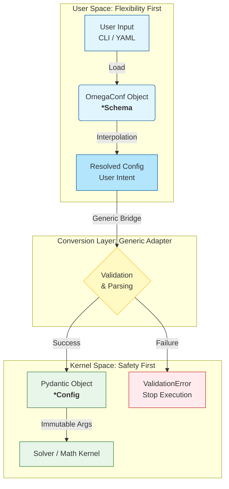
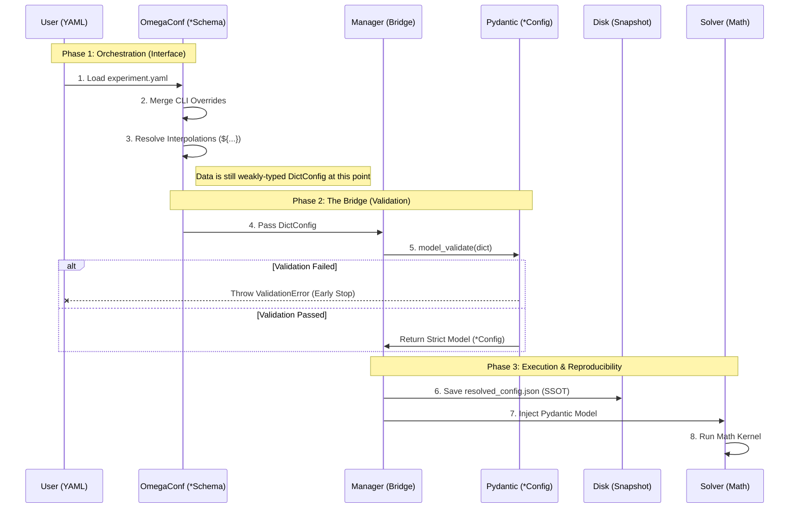

# Configuration System User Guide

**Version**: 0.16+
**Last Updated**: 2025-12-10

---

## Overview

MFG_PDE uses a **Dual-System Configuration Architecture** that balances runtime safety with experimental flexibility. This guide explains how to use the configuration system effectively.

---

## Architecture Diagrams

### 1. The Funnel Model (Core Concept)

This is the most macroscopic view. The configuration system acts like a funnel:

- **Upper Layer (OmegaConf)**: Wide opening, allows flexibility (interpolation, overrides, loose types)
- **Middle (Bridge)**: Filter screen, performs strict conversion
- **Lower Layer (Pydantic)**: Narrow opening, only allows absolutely correct, type-safe data through



### 2. Standard Execution Flow (Data Lifecycle)

This sequence diagram shows the complete journey of a configuration file in **Mode 3 (Hybrid/Production)** mode. Note the exact moments when **"Generic Bridge"** and **"Snapshot"** occur.



### 3. Parameter Sweeps (Mode 4: Research)

This is where the architecture shines. OmegaConf generates multiple "intents", while Pydantic validates each one. This is like a **factory assembly line**.

```mermaid
graph LR
    subgraph Generator [OmegaConf Generator]
        Base[Base YAML]
        Sweep[Sweep Config<br>alpha=[0.1, 0.5, 0.9]]
        Base -->|Hydra/Loop| Gen{Generate<br>Variations}
    end

    subgraph Pipeline [Execution Pipeline]
        Gen -->|Var 1| C1[Schema 1]
        Gen -->|Var 2| C2[Schema 2]
        Gen -->|Var 3| C3[Schema 3]

        C1 -->|Bridge| V1((Validate))
        C2 -->|Bridge| V2((Validate))
        C3 -->|Bridge| V3((Validate))

        V1 -->|Config 1| S1[Snapshot 1] --> Run1[Run 1]
        V2 -->|Config 2| S2[Snapshot 2] --> Run2[Run 2]
        V3 -->|Error!| Err[Stop Run 3]
    end

    style V1 fill:#a5d6a7
    style V2 fill:#a5d6a7
    style V3 fill:#ef9a9a
    style Err fill:#c62828,color:white
```

### Key Insights from Diagrams

1. **Clear Division of Labor**: From the diagrams, **OmegaConf (blue)** handles all "messy" things (merging, substitution, generation), while **Pydantic (green)** only receives clean, determined data.

2. **Snapshot Position**: In diagram 2, snapshot saving occurs **after validation passes, before solver runs**. This is the golden time point for ensuring reproducibility.

3. **Bridge as Isolation**: The Generic Bridge is the only channel connecting the two worlds, isolating complexity.

---

## Two Configuration Systems

| System | File | Suffix | Role | When to Use |
|:-------|:-----|:-------|:-----|:------------|
| **Pydantic** | `core.py` | `*Config` | Runtime validation | Direct Python usage, API calls |
| **OmegaConf** | `structured_schemas.py` | `*Schema` | YAML management | Experiments, parameter sweeps |

### Why Two Systems?

- **Pydantic** ensures mathematical correctness (e.g., `tolerance > 0`, `Nx > 0`)
- **OmegaConf** provides experiment flexibility (YAML files, interpolation, merging)

---

## Usage Patterns

### Pattern 1: Direct Python (Pydantic Only)

Best for: Unit tests, simple scripts, programmatic configuration.

```python
from mfg_pde.config import MFGSolverConfig, HJBConfig, FPConfig

# Create configuration directly in Python
config = MFGSolverConfig(
    hjb=HJBConfig(method="gfdm", accuracy_order=2),
    fp=FPConfig(method="particle", num_particles=5000),
    tolerance=1e-8,
    max_iterations=100,
)

# Use with solver
result = problem.solve(config=config)
```

### Pattern 2: YAML Configuration (OmegaConf Only)

Best for: Reproducible experiments, sharing configurations.

**experiment.yaml:**
```yaml
problem:
  name: "crowd_motion"
  T: 2.0
  Nx: 100
  Nt: 50

solver:
  type: "fixed_point"
  tolerance: 1e-8
  max_iterations: 200

  hjb:
    method: "gfdm"

  fp:
    method: "fdm"

experiment:
  name: "baseline_run"
  output_dir: "results/${experiment.name}"  # Interpolation!
```

**Python code:**
```python
from mfg_pde.config.omegaconf_manager import load_structured_mfg_config

# Load from YAML
config = load_structured_mfg_config("experiment.yaml")

# Access values with type safety
print(config.problem.T)        # 2.0
print(config.solver.tolerance) # 1e-8
```

### Pattern 3: Hybrid (Production Recommended)

Best for: Production runs where both flexibility and validation matter.

```python
from mfg_pde.config import MFGSolverConfig
from mfg_pde.config.omegaconf_manager import (
    create_omega_manager,
    load_structured_mfg_config,
)

# 1. Load flexible config from YAML
manager = create_omega_manager()
omega_config = load_structured_mfg_config("experiment.yaml")

# 2. Bridge to strict Pydantic config (validates everything)
pydantic_config = manager.bridge_to_pydantic(omega_config, MFGSolverConfig)

# 3. Solve with validated config
result = problem.solve(config=pydantic_config)

# 4. Save effective config for reproducibility
manager.save_effective_config(pydantic_config, output_dir="results/run_001")
```

### Pattern 4: Parameter Sweeps (Research)

Best for: Running multiple experiments with varying parameters.

```python
from mfg_pde.config.omegaconf_manager import create_omega_manager

manager = create_omega_manager()
base_config = manager.load_config("experiment.yaml")

# Define sweep parameters
tolerances = [1e-6, 1e-8, 1e-10]
grid_sizes = [50, 100, 200]

for tol in tolerances:
    for Nx in grid_sizes:
        # Create variant
        config = manager.create_variant(base_config, {
            "solver.tolerance": tol,
            "problem.Nx": Nx,
        })

        # Bridge and validate
        pydantic_config = manager.bridge_to_pydantic(config, MFGSolverConfig)

        # Run experiment
        result = problem.solve(config=pydantic_config)

        # Save with effective config
        output_dir = f"results/tol_{tol}_Nx_{Nx}"
        manager.save_effective_config(pydantic_config, output_dir)
```

---

## Configuration Classes Reference

### Pydantic Classes (`mfg_pde.config`)

```python
from mfg_pde.config import (
    MFGSolverConfig,  # Root solver configuration
    HJBConfig,        # HJB equation solver settings
    FPConfig,         # Fokker-Planck solver settings
    NewtonConfig,     # Newton iteration settings
)
```

### OmegaConf Schemas (`mfg_pde.config.structured_schemas`)

```python
from mfg_pde.config.structured_schemas import (
    MFGSchema,              # Complete MFG configuration
    ProblemSchema,          # Problem definition
    SolverSchema,           # Solver settings
    HJBSchema,              # HJB solver settings
    FPSchema,               # FP solver settings
    NewtonSchema,           # Newton settings
    ExperimentSchema,       # Experiment metadata
    DomainSchema,           # Spatial domain
    BoundaryConditionsSchema,
    InitialConditionSchema,
    LoggingSchema,
    VisualizationSchema,
    BeachProblemSchema,     # Specialized for beach problem
)
```

---

## Data Flow Summary

```
┌──────────────┐     ┌──────────────┐     ┌──────────────┐     ┌──────────────┐
│  YAML File   │────►│   OmegaConf  │────►│   Pydantic   │────►│    Solver    │
│              │     │   *Schema    │     │   *Config    │     │              │
│  (Flexible)  │     │  (Typed)     │     │  (Validated) │     │  (Executes)  │
└──────────────┘     └──────────────┘     └──────────────┘     └──────────────┘
                           │                     │
                           │                     │
                     Interpolation          Validation
                     ${...} syntax          tolerance > 0
                     Config merging         Nx > 0
                     CLI overrides          Type coercion
```

---

## Best Practices

### 1. Always Save Effective Configs

For reproducibility, always save the resolved configuration:

```python
# After bridging to Pydantic
manager.save_effective_config(pydantic_config, output_dir)
```

This creates `resolved_config.json` with all defaults filled and interpolations resolved.

### 2. Use Type Hints

Both systems support IDE autocompletion:

```python
# Pydantic - fully typed
config: MFGSolverConfig = MFGSolverConfig(...)
config.tolerance  # IDE knows this is float

# OmegaConf - typed via schemas
schema: MFGSchema = load_structured_mfg_config("config.yaml")
schema.solver.tolerance  # IDE knows this is float
```

### 3. Validate Early

Always bridge to Pydantic before running expensive computations:

```python
# Good: Validate before solve
pydantic_config = manager.bridge_to_pydantic(omega_config, MFGSolverConfig)
result = problem.solve(config=pydantic_config)  # Will not fail on bad config

# Bad: Validate during solve
result = problem.solve(config=omega_config)  # May fail mid-computation
```

### 4. Use Interpolation for DRY Configs

```yaml
experiment:
  name: "convergence_study"
  output_dir: "results/${experiment.name}"  # Automatically: results/convergence_study

problem:
  Nx: 100
  Nt: ${problem.Nx}  # Same as Nx for isotropic grids
```

---

## Migration Notes

### From Old `*Config` Names (v0.15 and earlier)

If you were importing OmegaConf schemas with `*Config` names, update to `*Schema`:

```python
# Old (deprecated, will be removed in v0.18)
from mfg_pde.config.structured_schemas import HJBConfig, MFGConfig

# New (v0.16+)
from mfg_pde.config.structured_schemas import HJBSchema, MFGSchema
```

The old names still work but emit `DeprecationWarning`.

---

## Troubleshooting

### "DictConfig has no attribute 'X'"

**Cause**: Using raw OmegaConf without structured schemas.

**Solution**: Use the structured loading functions:
```python
# Bad
config = OmegaConf.load("config.yaml")  # Returns DictConfig

# Good
config = load_structured_mfg_config("config.yaml")  # Returns typed MFGSchema
```

### Validation Error on Bridge

**Cause**: YAML values don't meet Pydantic constraints.

**Solution**: Check the error message and fix the YAML:
```
ValidationError: tolerance must be positive, got -1e-8
```

### Missing Fields After Load

**Cause**: YAML doesn't specify all fields, but schema has defaults.

**Solution**: This is normal - defaults are automatically filled. Check with:
```python
print(OmegaConf.to_yaml(config))  # See all values including defaults
```

---

## See Also

- `docs/development/PYDANTIC_OMEGACONF_COOPERATION.md` - Architecture details
- `mfg_pde/config/core.py` - Pydantic class definitions
- `mfg_pde/config/structured_schemas.py` - OmegaConf schema definitions
- `mfg_pde/config/omegaconf_manager.py` - Manager utilities
